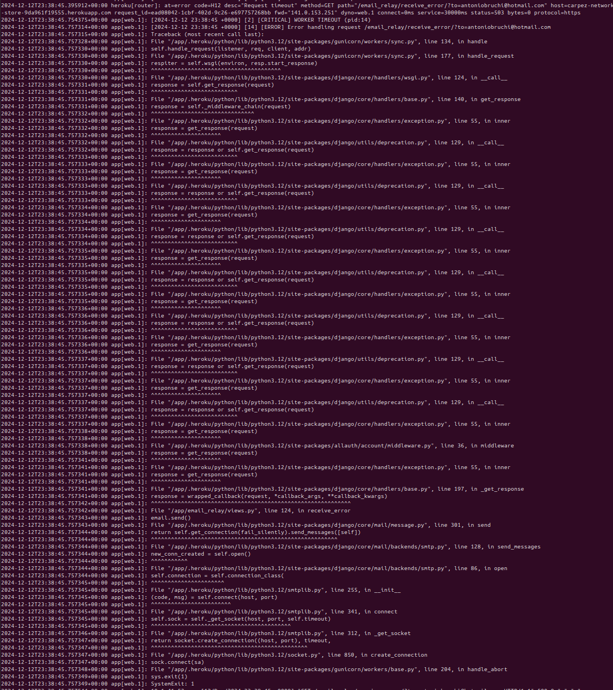

# email_relay application

Application that handles sending emails.

## Development

### vscode terminal
```python
python manage.py createapp email_relay
```

### '/ecommerce/settings.py'
```python
INSTALLED_APPS = [
    ...
    'email_relay',
    ...
]
```

## Why
It comes from a bug I was not able to fix. With this settings and this code on my local machine, behind a basic firewall and inside a virtual environment, I was able to send emails directly from the app.

```python
# default backend
EMAIL_BACKEND = 'django.core.mail.backends.smtp.EmailBackend'
EMAIL_HOST = config(str("EMAIL_HOST")) # smtp.gmail.com
# port should be 587 if tls 465 if ssl
EMAIL_HOST_PORT = config(str('EMAIL_HOST_PORT')) # 587
EMAIL_HOST_USER = config(str("EMAIL_HOST_USER")) # carpez@carpez-network.com
EMAIL_HOST_PASSWORD = config(str("EMAIL_HOST_PASSWORD"))
# tls and ssl cannot be used at the same time
EMAIL_USE_TLS = config(str('EMAIL_USE_TLS'), cast=bool, default=True) # True
EMAIL_USE_SSL = config(str('EMAIL_USE_SSL'), cast=bool, default=False) # False
DEFAULT_FROM_EMAIL = EMAIL_HOST_USER
```

```python
from django.core.mail import EmailMultiAlternatives

email = EmailMultiAlternatives(
    subject,
    body,
    settings.EMAIL_HOST_USER,
    [cust_email]
)
email.fail_silently=False
try:
    email.send()
except Exception as e:
    print(e)
```

However when pushed on heroku it was not working anymore. I double and triple checked every environment variables, changed port numbers to integers, switch from tls to ssl, reset the google app password, of course none of it worked since the error was a socket timeout error and it was affecting also the registration process. User would try to register, receive the socket timeout error. They would be registered but not activated with no activation email.
After adding the debug view receive_error, if I run it locally it successfully sends the email.
If I run it on heroku, it return application error page, even is debug is true, and the logs on heroku looks like this



I honestly still don't know what's really wrong and how to solve it.
So I created a very small Flask App, here the (repository)[https://github.com/antoniobruchidev/carpez-email-relay].
It's deployed https://carpez-network-3bb390eeb294.herokuapp.com/ and it has only one route send_email which accepts a POST request with 'subject', 'body', 'sender', 'recipient' and 'secret'.
While the first four are for the email to be sent, the 'secret' one is to have an additional password otherwise everybody would be able to use it.

## Testing
- send_confirmation_email is called by the webhook and can be called manually changing the status in the superuser dashboard.
- send_dispatched_email and send_delivered_email are called from the superuser dashboard when changing the status.
- They all render the email as expected including discounts if present.